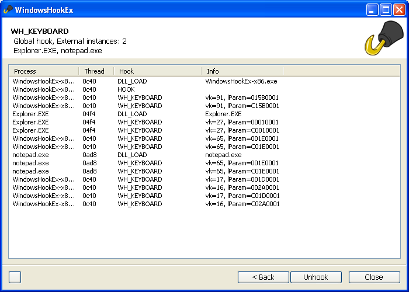
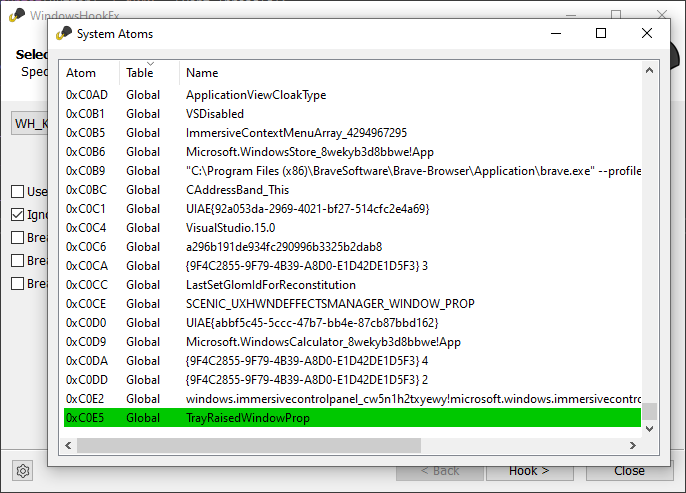

# WindowsHookEx

## A utility designed to investigate the behavior of the Windows api 'SetWindowsHookEx', and the behavior of the system when installing / calling hooks.

See https://learn-more.github.io/WindowsHookEx/ for an overview of the features.

## Includes an Atom viewer

New and deleted Atoms are highlighted:

The UI is based on the [Wizard-2020 Project](https://github.com/enlyze/Wizard-2020/) from Enlyze

