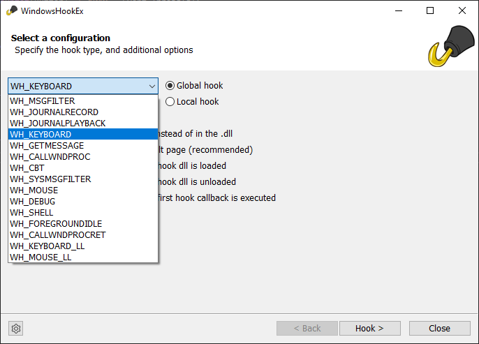

# WindowsHookEx

## Why WindowsHookEx?
When developing tooling to work with [Windows Hooks](https://docs.microsoft.com/en-us/windows/win32/api/winuser/nf-winuser-setwindowshookexa), it is usefull to see it in action.
Additionally, when working on [ReactOS](https://reactos.org) it is a good tool to compare Windows against ReactOS behavior.

## Features
* Choose what type of hook to install:
    * WH_MSGFILTER
    * WH_JOURNALRECORD
    * WH_JOURNALPLAYBACK
    * WH_KEYBOARD (default)
    * WH_GETMESSAGE
    * WH_CALLWNDPROC
    * WH_CBT
    * WH_SYSMSGFILTER
    * WH_MOUSE
    * WH_DEBUG
    * WH_SHELL
    * WH_FOREGROUNDIDLE
    * WH_CALLWNDPROCRET
    * WH_KEYBOARD_LL
    * WH_MOUSE_LL
* Configure hook options:
    * Use a hook procedure in the .exe instead of in the .dll - This might not work on all hook types!
    * Ignore hook messages for the result page
    * Break into the debugger when the hook dll is loaded
    * Break into the debugger when the hook dll is unloaded
    * Break into the debugger when the first hook callback is executed
* Show all received events, including:
    * Hook dll load events
    * Hook dll unload events
    * Hook messages received, with decoded arguments
* All received events include the process name and Thread ID on which they are received!
* Show processes where the hook dll is loaded
* An Atom viewer, showing [Global and User Atoms](https://docs.microsoft.com/en-us/windows/win32/dataxchg/about-atom-tables).
    * Highlight Added Atoms (green)
    * Highlight Removed Atoms (red)

## Screenshots

Available options:

Hook types:
  

Atom viewer:

